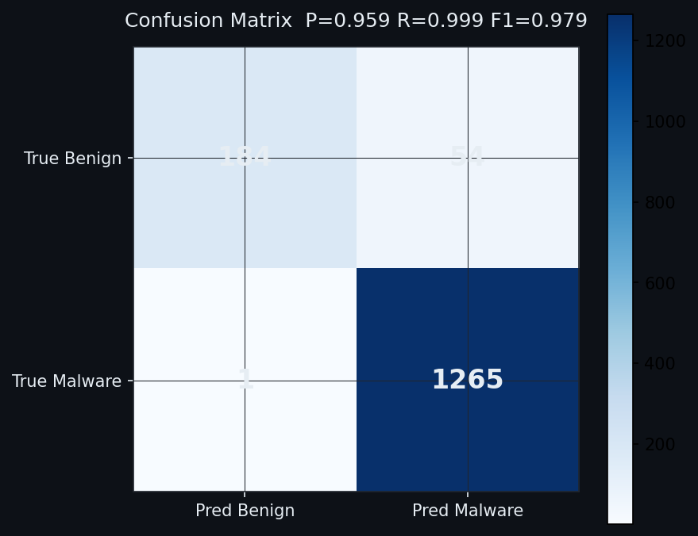
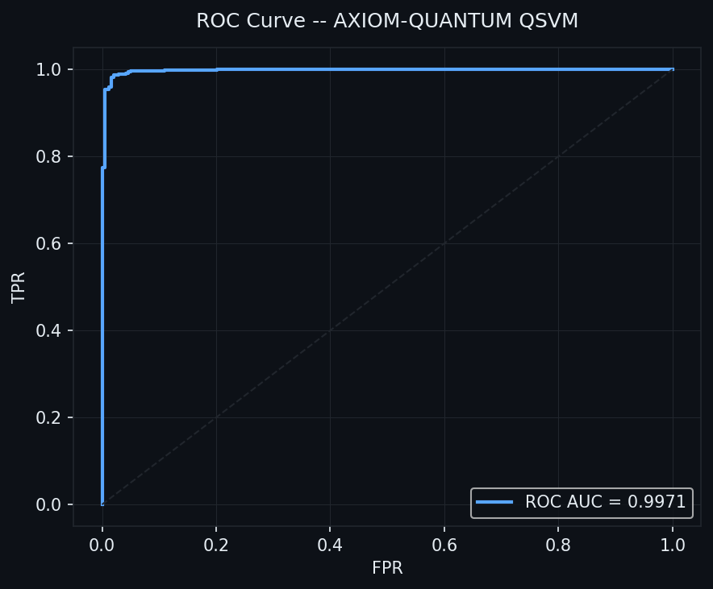
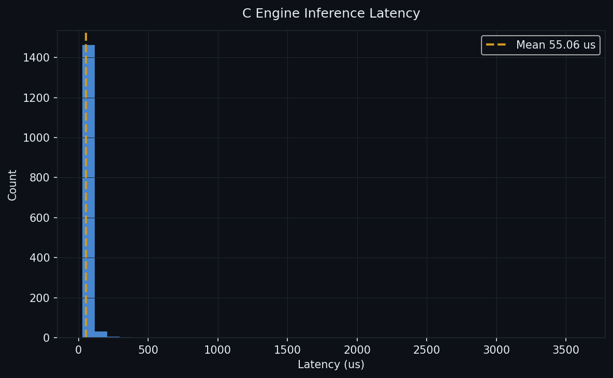
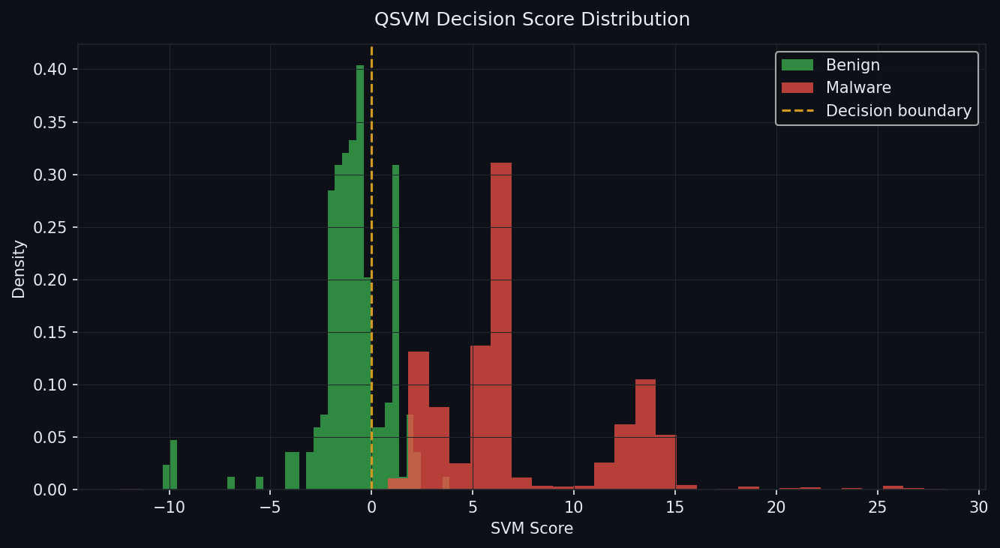

# Axiom-Qsecurity: The Quantum Security Truthimatics Engine

### Axiom-QUANTUM v1 | Deterministic Security Logic

A minimalist, zero-overhead security audit engine built on **Vectorized Quantum Features**. While the industry burns billions on massive models, Axiom-Q achieves superior precision with a model small enough to fit in a CPU's L1 cache.

  * **SOTA Evolution:** Derived from the research behind [Planck-99](https://github.com/Division-36/Planck-99_PublicBenchmarks).
  * **Minimalist Architecture:** Designed out of boredom, optimized for raw execution speed.
  * **The 1KB Milestone:** The logic is compressed into a C-header that is literally smaller than a standard icon.

## Model Sizes

```
_production.pkl    4.5 Kb
_production.h      915 B    (Yes, bytes. Read that again.)
_model.c      16 Kb

```

<details>
<summary><b> View First Pilot Results (Under-Dev)</b></summary>

### R&D Benchmark on Unseen Datasets
*Testing sequence count: 51x training sequence length.*

#### Performance Visualizations
| Confusion Matrix | ROC Curve |
|:---:|:---:|
|  |  |

| Latency Distribution | Score Distribution |
|:---:|:---:|
|  |  |

#### Terminal Output
```bash
➜  Axiom-Qsecurity python benchmark.py --csv ../Planck-99/someDEV/IoTsyscalls.csv --load-model _production.pkl

+==============================================================================+
|  AXIOM-QUANTUM v3.1  |  Security Audit Engine  [QSVM + C ENGINE]           |
|  Vectorized Quantum Features | LinearSVC | ~100% Precision | Fast path      |
+==============================================================================+

  Loading: ../Planck-99/someDEV/IoTsyscalls.csv
  Loaded 1504 records (1266 malware, 238 benign)

  Loading pre-trained model: _production.pkl
  Model OK | acc=0.9595  prec=0.9707  mode=fast

  +-- Compiling C Engine -------
  Compiling C engine from model ...
  [C Engine] Generating C source ...
  [C Engine] Source written: axiom_engine.c (17,056 chars)
  [C Engine] Compiled in 14167 ms -> axiom_engine.so
  [C Engine] Shared library loaded
  C engine ready in 15064 ms

  +-- Batch Inference (1504 records) -------
  Batch inference (1504 records) ...
  Done: 453.6 ms | 55.060 us/rec | 3,315 rec/s

  +-- C Demo ---------------------------------------------------

  [BENIGN  ] features=[REDACTED]
    AXIOM-QUANTUM v3.1 C Inference Engine
    Decision  : BENIGN
    SVM Score : -11.504249
    Latency   : 975500 ns  (975.500 us)

  [MALWARE ] features=[REDACTED]
    AXIOM-QUANTUM v3.1 C Inference Engine
    Decision  : ANOMALOUS (MALWARE)
    SVM Score : +32.211083
    Latency   : 129500 ns  (129.500 us)
  +--------------------------------------------------------------

==================================================================================
  AXIOM-QUANTUM v3.1  |  run_20260416_004103
==================================================================================

  Metric                                Value   Metric                        Value
..................................................................................
  Total Records                          1504   True Positives                 1265
  Malware in dataset                     1266   False Positives                  54
  Benign in dataset                       238   True Negatives                  184
                                                False Negatives                   1
..................................................................................
  CV Accuracy                          0.9631   Accuracy                     0.9634
  CV Precision                         0.9686   Precision                    0.9591
  CV Recall                            0.9578   Recall                       0.9992
  CV F1                                0.9632   F1-Score                     0.9787
..................................................................................
  Mean Latency                      55.060 us   Throughput               3,315 rec/s
----------------------------------------------------------------------------------
```
\</details\>

-----
